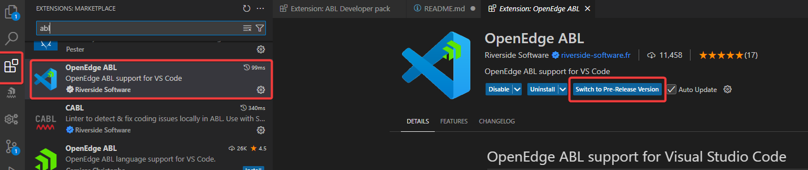
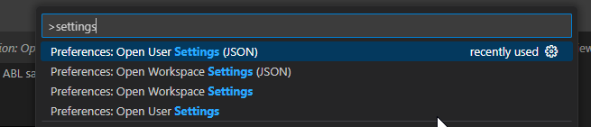

# VsCode OpenEdge ABL sample workspace

This repo is an example of a workspace configured for https://marketplace.visualstudio.com/items?itemName=cverbiest.abl-developer-pack.
It also recommends some extensions not strictly ABL, but usefull in this context.

## What is here

This repo contains sample config for the extensions that require extra setup.

I tried to have all configuration inside the git repo, you'll probably want some settings global instead of per workspace.

* Riverside OpenEdge ABL workspace `openedge-project.json`
* PCT ant setup, clean and build tasks `build.xml`
* Launch configs `.vscode\tasks.json`
* ABL code snippets `.vscode\abl-lowercase.code-snippets`

## Non OpenEdge

* File templates for ABL class enum interface procedure `.vscode\templates`
* Web search : Search OpenEdge docs and Progress related sites `abl.code-workspace`
* Task explorer : launch Tasks
* Gitlens : In editor  git info
* ErrorLens : In editor errors and warning info
* Prettier formatter
* Replace rules : Create rule(set) for certain replaces e.g remove user/domain from log file `abl.code-workspace`
* vscode-position

## How to use

### VsCode portable version (optional)

If you want to try this without changing your current VsCode setup you can use a [portable version of VsCode](https://code.visualstudio.com/docs/editor/portable). 
I used the VsCode insiders version to test this in a clean VsCode installation.

### Repo setup

Clone this repo and open the abl.code-workspace using vscode, it should prompt you to install the extension pack.

```
git clone https://github.com/cverbiest/vscode-abl-sample-workspace.git
code vscode-abl-sample-workspace\abl.code-workspace
```

### Riverside OpenEdge ABL config

#### Switch to pre-release version


#### Configure your OpenEdge install location



```
    "abl.configuration.runtimes": [
        {
            "name": "12.8",
            "path": "C:\\Progress\\Openedge-12.8"
        },
        {
            "name": "12.2",
            "path": "C:\\Progress\\Openedge-12.2"
            "default": true
        }
    ],
    "terminal.integrated.env.windows": {
        "DLC": "C:\\Progress\\Openedge-12.8"
    }
``` 

## Useful resources
[VsCode getting started](https://code.visualstudio.com/docs/getstarted/getting-started), make sure to read the [tips and tricks](https://code.visualstudio.com/docs/getstarted/tips-and-tricks)

[Riverside VsCode ABL workshop](https://wiki.rssw.eu/workshop/01-Install)

[PCT documentation](https://github.com/Riverside-Software/pct/wiki/) 

## Todo

It is a spare time project, I'm not sure if I will enable issues on the repo or not, I'll probably try it. 

* add documentation to highlight certain features